# Machine Learning Trading Bot

This script  combines algorithmic trading with financial Python programming and machine learning to create an algorithmic trading bot that learns and adapts to new data and evolving markets.

---
## Analysis

### <u> Baseline Performance </u>
<br>
Slow SMA window = 4<br>
Fast SMA window = 100<br>
Training Data Window = 6 months<br>

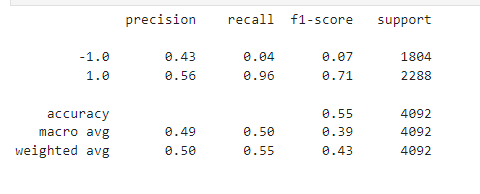
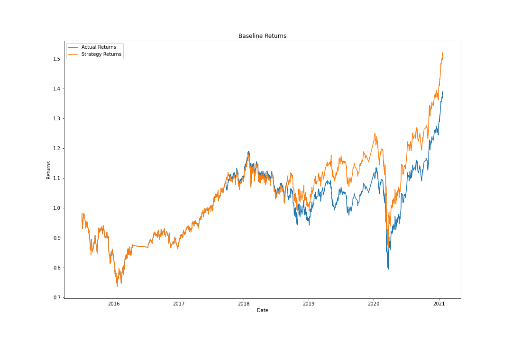

### <u> Tuned Baseline Performance </u>

1. Tuning the training algorithm by adjusting the size of the training dataset
    * Slow SMA window = 4<br>
      Fast SMA window = 100<br>
      Training Data Window = 2 months<br>

    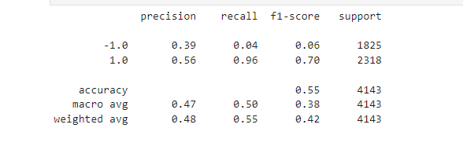
    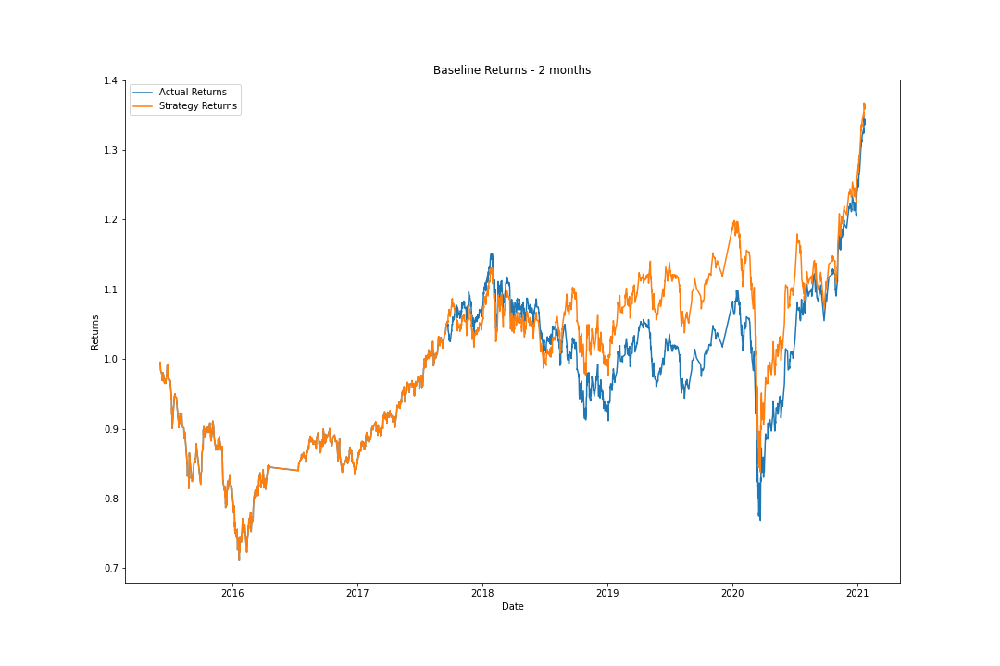

    * Slow SMA window = 4<br>
      Fast SMA window = 100<br>
      Training Data Window = 6 months<br>

    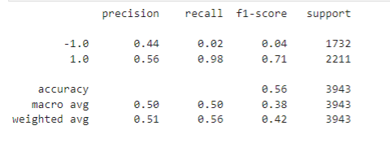
    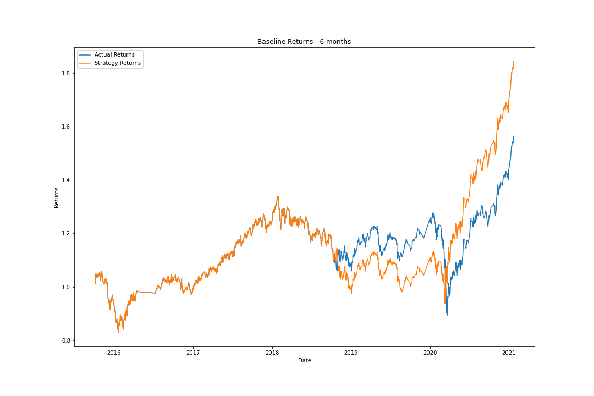

    **Question**: What impact resulted from increasing or decreasing the training window?

    **Answer**:Decreasing the training window  to 2 months did not have any significant impact on the results. The accuaracy remained at 55% and the recall values did not change. The precision value however for a sell position reduced from 43% to 39%

    Increasing the training window to 6 months did increase the accuaracy by 1% to 56%. The recall value for a buy position increases by 2% and for the sell position decreases by 2%!The precision value for a buy position remains the same however it increases by 1% for the sell position. 

    Overall we see a improvement in the predictivve analysis when we increase the training window. 
---
2. Tuning the training algorithm by adjusting the SMA input features
    * Slow SMA window = 25<br>
      Fast SMA window = 100<br>
      Training Data Window = 3 months<br>

    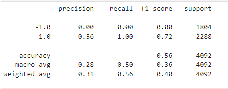
    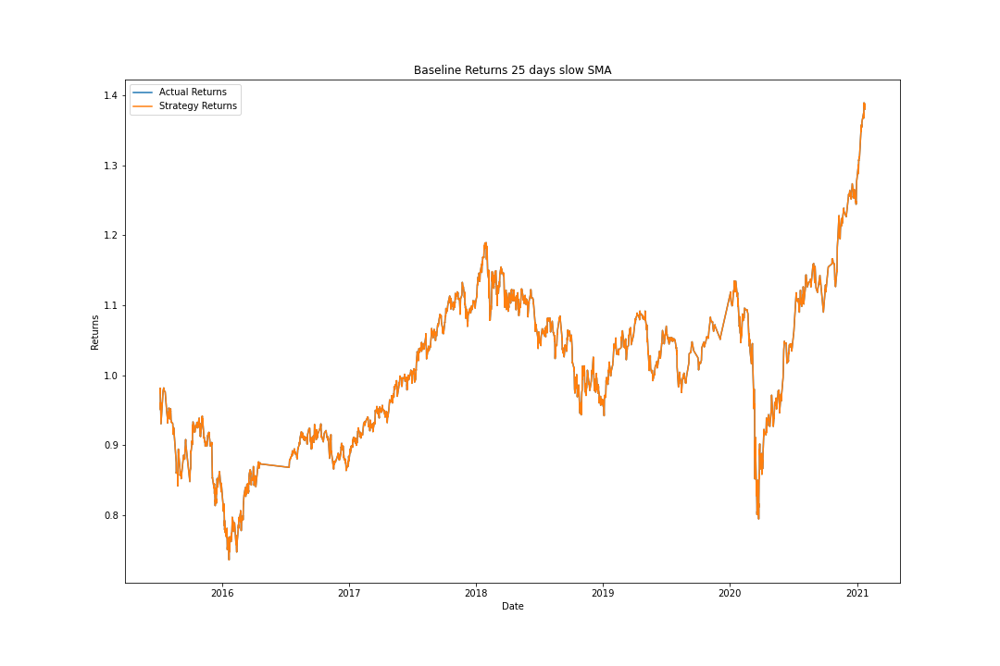

    * Slow SMA window = 4<br>
      Fast SMA window = 50<br>
      Training Data Window = 3 months<br>

    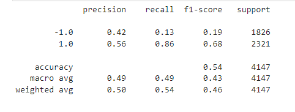
    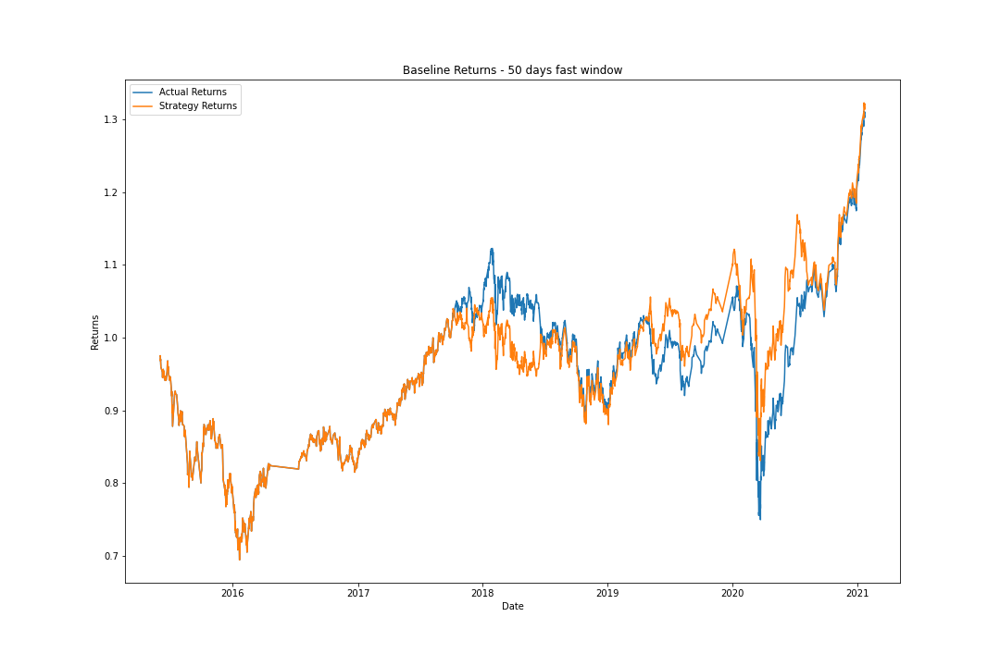

    * Slow SMA window = 4<br>
      Fast SMA window = 200<br>
      Training Data Window = 3 months<br>

    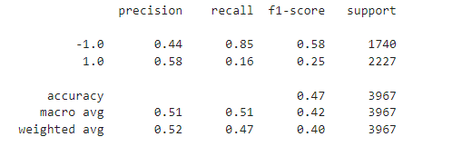
    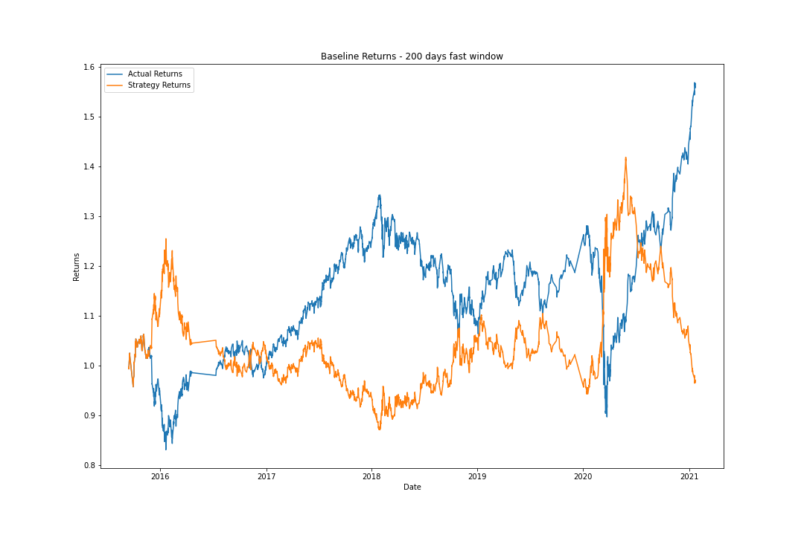

    **Question**: What impact resulted from increasing or decreasing either or both of the SMA windows?

    **Answer**: Increasing the Slow SMA window to 25, increases the accuracy to 56%, but it completely eliminates detecting the sell signal, which is not desirable.
    
    Decreasing the Fast SMA window to 50, reduces the accuracy by 1%. It also reduces the recall value of the buy position from 96% to 86%

    Increasing the Fast SMA window to 200, further reduces the accuracy to 47%. We also see a significant reduction in the recall value for our buy position from 96% to 16%. We can hereby say that the best possible value for the Fast SMA window is 100.

---
3. Training algorithm based on the set of parameters that best improved the trading algorithm returns
    * Slow SMA window = 3<br>
      Fast SMA window = 100<br>
      Training Data Window = 6 months<br>

    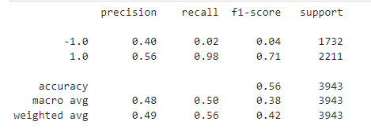
    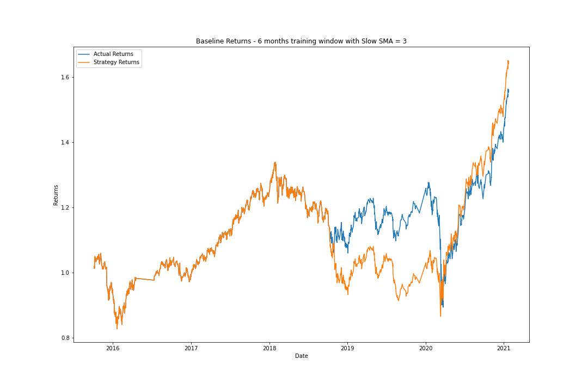
---

### <u> New Machine Learning Classifier - AdaBoostClassifier </u>

1. AdaBoostClassifier applied to baseline model
    * Slow SMA window = 4<br>
      Fast SMA window = 100<br>
      Training Data Window = 3 months<br>

    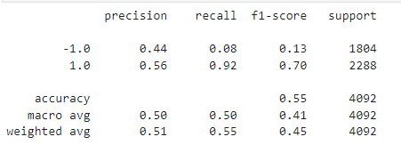
    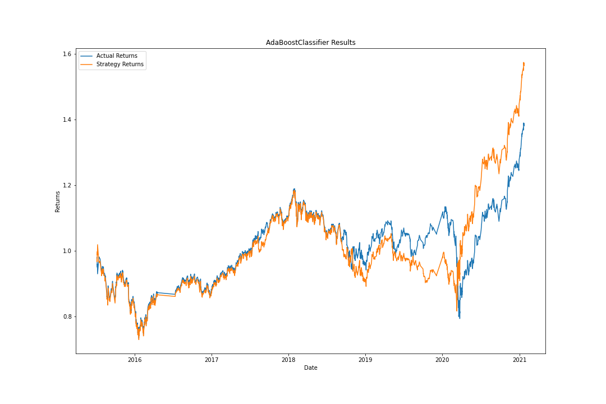

    **Question**: Did this new model perform better or worse than the provided baseline model? 
    **Answer**: The ada model performed similar to the baselime model with the same accuracy. The recall value for the buy position dropped to 92%
---
2. AdaBoostClassifier applied to tuned model
    * Slow SMA window = 3<br>
      Fast SMA window = 100<br>
      Training Data Window = 6 months<br>

    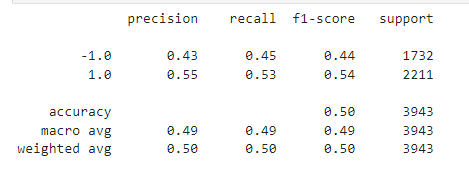
    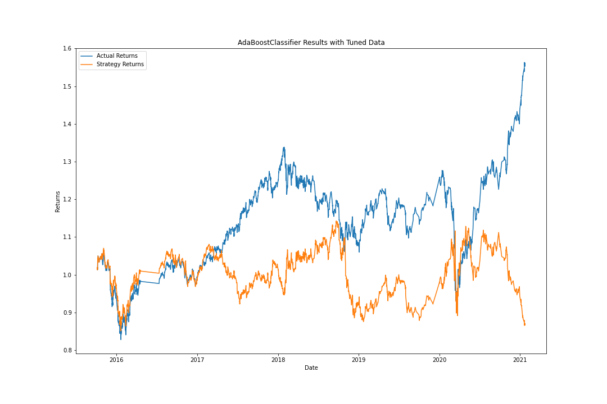

    **Question**: Did this new model perform better or worse than your tuned trading algorithm? 
    **Answer**: The ADABoost model performed worse than the tuned trading algorithm. The accuracy was reduced to 50%. The recall values are well balanced with this
---
### <u> Evaluation Report </u>

* Increasing the training data window to 6 months provides a more accurate resulot. However further increase in the training window may lead to overfitting.
* Decreasing the training data window does not have any significant effect on the trading results
* Increasing the Slow SMA window to more than 4 can lead to increase in accuracy, but it completely eliminates the detection of sell signal. So this parameter change is undesirable.
* Increasing or Decreasing the Fast SMA window from 100, compromises the accuracy of the model.
* A combination of increase in training window and decrease in the slow SMA window gives us a overall good accuracy with the SVM model.
* The AdaBoost Classifier performs better with the baseline dataset, but significantly compromises on accuracy when applied to the tuned dataset. 
* Overall SVM model performs better than the AdaBoostClassifier model

---
## Technologies

This project uses python 3.7 along with the following packages:

* [JupyterLab](https://jupyterlab.readthedocs.io/en/stable/) - Web based user interface for data analysis.

* [pandas](https://github.com/pandas-dev/pandas) - Data analysis and manipulation library.

* [numpy](https://numpy.org/) - The fundamental package for scientific computing with Python

* [hvplot](https://pyviz-dev.github.io/hvplot/) - A high-level plotting API for the PyData ecosystem built on HoloViews.

* [sklearn](https://github.com/scikit-learn/scikit-learn) - A Python module for machine learning built on top of SciPy

---

## Installation Guide

Please install the following before starting the application

```python
  pip install jupyterlab
  pip install pandas
  pip install numpy
  pip install hvplot 
  pip install scikit-learn
```
---

## Usage

To use the Venture Funding tool, please download and open the **machine_learning_trading_bot.ipynb** in jupyter lab after executing
the following on the command line:

```python
jupyter lab
```
Jupytper Lab should open automatically in a browser. 
If it does not, please follow the instructions on the command line.

---

## Contributors

Abhishika Fatehpuria (abhishika@gmail.com)

---

## License

MIT